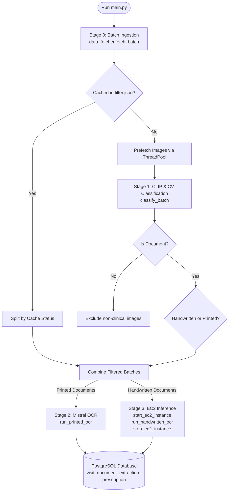
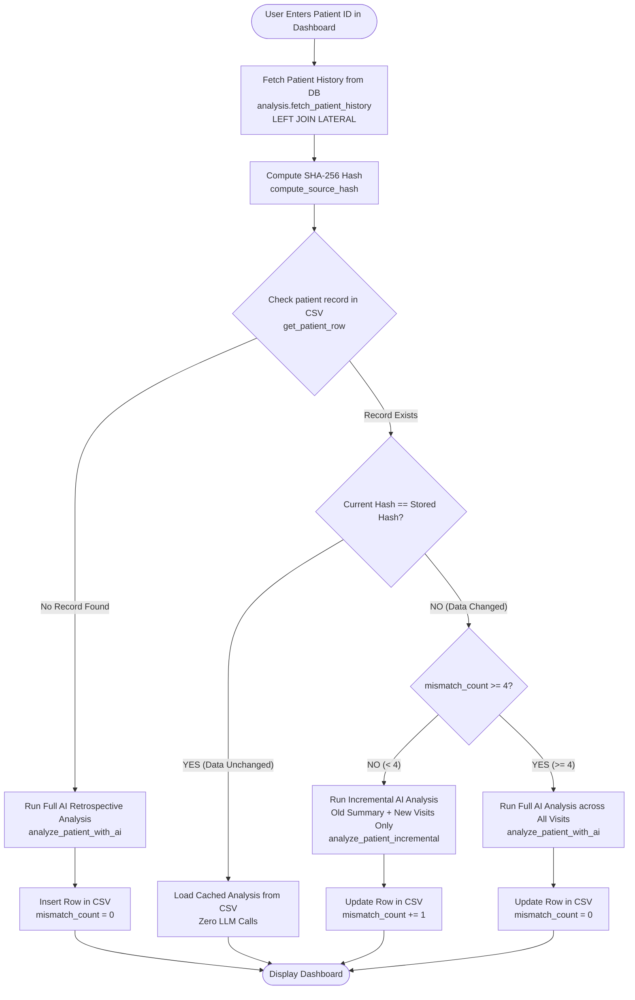

# Complete Architecture: Two-Stage System Pipeline

This system consists of two independent pipelines:
1. **Pipeline 1: Document Processing & Extraction Pipeline (`/`)** — Ingests raw clinical images, classifies them, extracts text/data via OCR, and writes structured records into PostgreSQL.
2. **Pipeline 2: Clinical Retrospective & Analytics Pipeline (`/dataanalysis`)** — Aggregates patient longitudinal history from PostgreSQL, optimizes AI usage using deterministic hashing & cache/delta logic, and serves a Streamlit dashboard.

---

## 1. Flowchart: Pipeline 1 (Ingestion, Classification & OCR)

---

## 2. Flowchart: Pipeline 2 (Clinical Analysis, CSV Cache & Dashboard)

---

## Module Overview

| Pipeline | Main Directory | Key Files | Function |
| :--- | :--- | :--- | :--- |
| **1. OCR Extraction** | Root (`/`) | `main.py`, `data/data_fetcher.py`, `preprocessing/clip_preprocessing.py`, `model/mistral_printed.py`, `model/handwritten.py` | Ingests images, filters non-documents, routes printed/handwritten to OCR engines, and stores extracted text in PostgreSQL. |
| **2. Analytics & Storage** | `dataanalysis/` | `analysis.py`, `Zai_analysis.py`, `storage/ai_analysis_csv.py`, `csv_dashboard.py` | Fetches consolidated visit history, tracks changes with SHA-256 hashes, maintains token-efficient CSV cache/upserts, and renders interactive dashboard. |