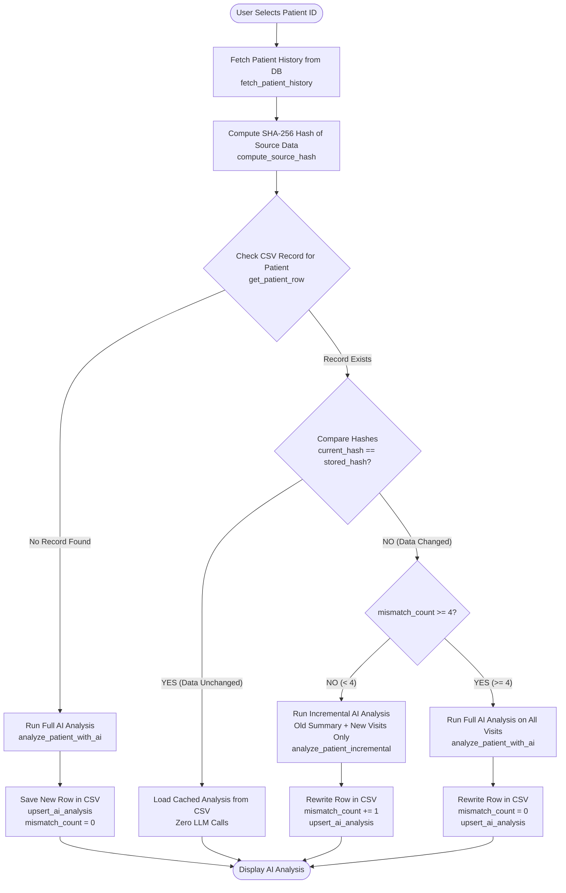

# Clinical AI Retrospective Analysis & CSV Persistence Pipeline

## Pipeline Flowchart

---

## File Roles & Architecture

| File | Purpose |
| :--- | :--- |
| **`analysis.py`** | Fetches visit history, aggregated documents, and prescriptions using PostgreSQL `LEFT JOIN LATERAL`. |
| **`Zai_analysis.py`** | Manages full prompt (`analyze_patient_with_ai`) and token-saving delta prompt (`analyze_patient_incremental`). |
| **`storage/ai_analysis_csv.py`** | Handles single-row per patient CSV upserts, hash computation, and JSON storage in `data/patient_ai_analysis.csv`. |
| **`ai_review_service.py`** | Shared cache-first orchestration; returns unchanged reviews without an LLM call and routes source changes to incremental or full review. |
| **`patient_chat.py`** | Retrieves question-relevant, selected-patient evidence from normalized visits and extracted OCR text, then makes one grounded Q&A call. |
| **`app.py`** | The single Streamlit application and clinical dashboard. |
| **`csv_dashboard.py`** | Backward-compatible launch path that imports `app.py`; it has no separate dashboard logic. |

Both supported launch commands use the same application: `streamlit run app.py` or `streamlit run csv_dashboard.py`. Patient Q&A uses the patient-scoped normalized database record and OCR extraction as its fallback source. Neo4j is not configured or required.
